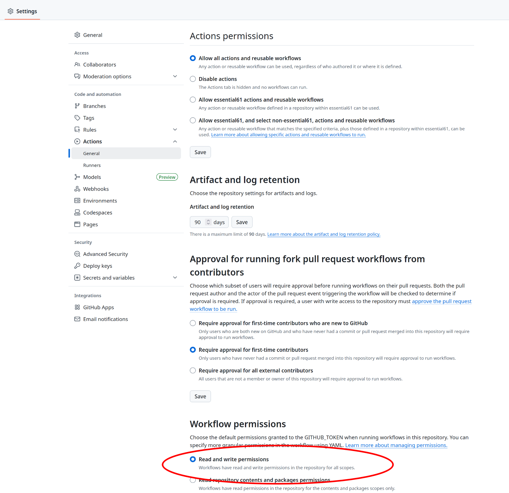
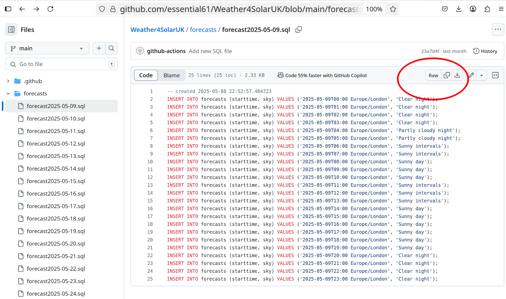

# Weather4SolarUK
This repo hosts a pair of python scripts (using the beautiful soup library) to scrape place-specific, weather forecast information from the UK met office website.

As the owner of a Solar installation, I am specifically interested in how likely it is for tomorrow to be sunny or overcast where I live, as well as to be able to correlate historical weather forecasts against photo-voltaic energy produced.

Each script is run as GitHub action using time of day as the trigger.

The first script runs once a day and fetches the forecast for the following day.

The second script runs hourly during daylight to fetch the forecast for the next hour to record the most recent update.

The output of the scripts is a SQL batch file that either INSERTs or UPDATEs rows of a table as described below.

    CREATE TABLE public.forecasts (
	 starttime timestamptz NOT NULL,
     sky text NULL,```
     CONSTRAINT forecasts_pk PRIMARY KEY (starttime)
    );

#### Location-specific code
The Python scripts are each passed the code for the specific location to fetch weather data for as a command-line parameter. If you wish to clone this repo, you are most likely to want to fetch forecasts for your specific region. You will need to edit the yml files in .github/workflows
e.g.

    - name: execute py script # run metoffice.py with 'place_code' parameter
    run: python metoffice.py <your place-code>`

and

    - name: execute py script # run metoffice_update.py with 'place_code' parameter
    run: python metoffice_update.py <your place-code>`

To find your place code, look at the url of the search result for your location returned from https://www.metoffice.gov.uk/

i.e.

    https://weather.metoffice.gov.uk/forecast /{place_code}?date=YYYY-mm-dd
#### Repo Permissions
In order for the scripts to update the repo with the latest weather forecast, the GITHUB_TOKEN requires write permission on the repository.



#### Raw file for download
To individually download any generated files, you can select the 'raw' URL for the file i.e ```https://raw.github.com/...```

#### crontab accuracy
Scheduling when the github actions run is specified using a crontab-style syntax. Times are specified in UTC. Note that the actual runtime for the action can differ from the specified time by a several minutes.


